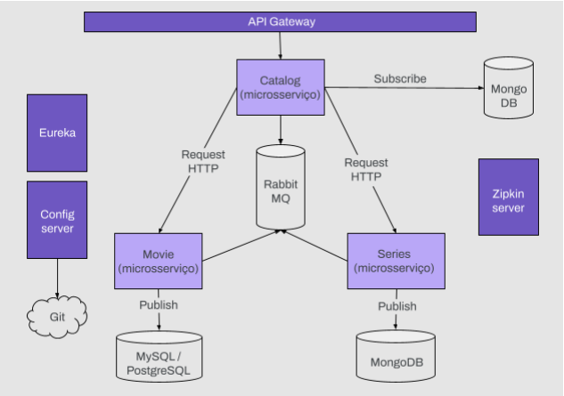

<h1 align="center">
  💻 Avaliação 2 Especialização em Back End I
</h1>

## 📚 Contextualização

O projeto consiste em 3 microsserviços: Filme, Série e Catálogo. O catálogo é um
microsserviço que lê informações de Filmes e Séries a fim de enviar um catálogo ao cliente.
O catálogo recebe uma mensagem toda vez que um filme ou uma série são lançados e os
persiste em um banco de dados MongoDB não-relacional. Quando recebe uma solicitação
do cliente, ele pesquisa o banco de dados e responde.
---

## 💼 Tecnologias utilizadas
Para o desenvolvimento utilizei as seguintes tecnologias:

- Java;
- Spring Boot;
- Spring Cloud;
- Eureka;
- RabbitMQ
- Zipkin;
- Resilence4J;
- Docker;
- MongoDB;

---